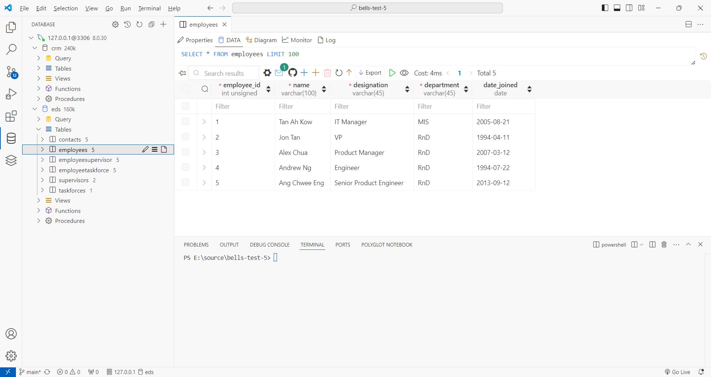
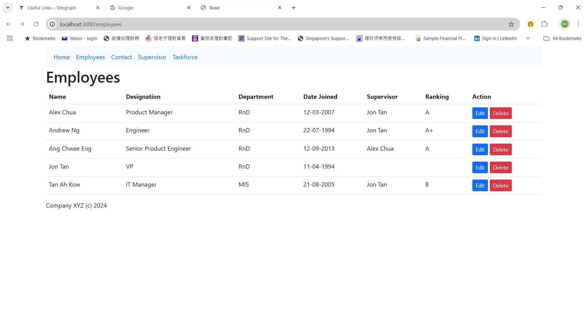
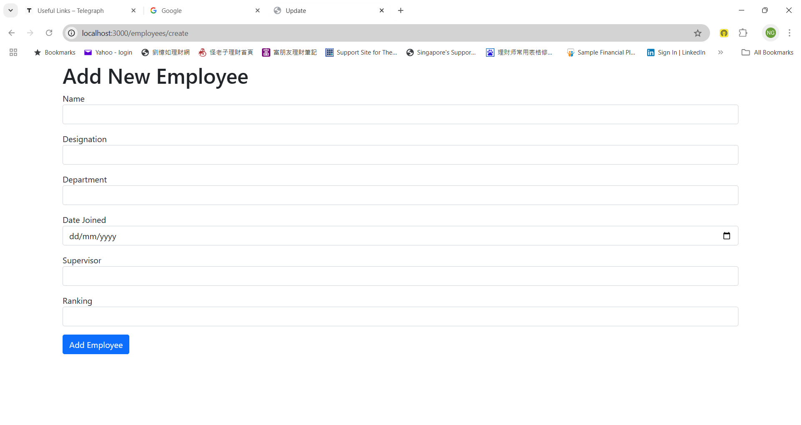
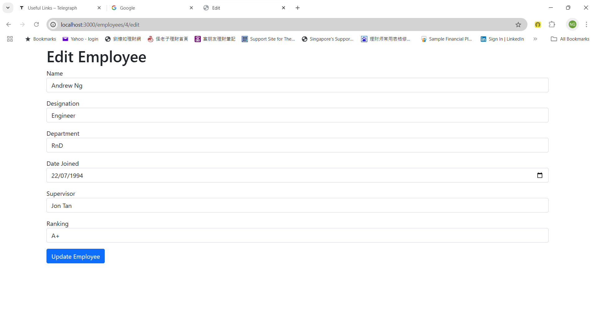
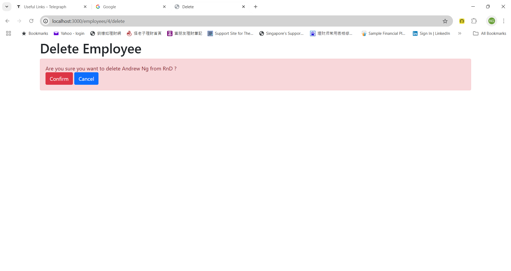

<!-- .md means markdown -->

<!-- README.md -->
<!-- This file documents the information about the portfolio project. -->
<!-- It should be READ ME first!!! -->

<!-- Heading level 1 -->
# BELLS-TEST-5
**(SCTP) Full Stack Developer**

Module 7: **Back End Development**

***Project Assignment - Portfolio***

<!-- Heading level 3 -->
### Project File Structure:

* JavaScript Files

>>> Employees MySQL-Database System
: 

* BELLS-TEST-5 Folder (Sources Root)
: index.js
: .env
: .gitignore
: README.md
: package.json
: package-lock.json
: schema.sql
: data.sql

* DIAGRAM Folder (diagrams)
: q6-employees.md
: q6-employees-ER-diagram.png
: q6-employees-LS-diagram.png

* IMG Folder (images)
: mysql-eds-database.png
: mysql-GET-Read.png
: mysql-POST-Create.png
: mysql-POST-Update.png
: mysql-POST-Delete.png

* VIEWS Folder (views)
  
- layouts sub-folder
: base.hbs
: nav.hbs

- taskforces sub-folder
: taskforces.hbs

- supervisors sub-folder
: supervisors.hbs

- contacts sub-folder
: contacts.hbs

- employees sub-folder
: index.hbs
: create.hbs
: edit.hbs
: delete.hbs


<!-- Heading level 1 -->
# Project Guide
For the purpose of the portfolio project, a handlebars-driven backend application is created for the following:

```json
{
1. "CRUD Backend Application via HTTP-form-methods" : in our case "Employees MySQL-Database System"
}
```

This project is about a simple *Employees MySQL-Database System (EDS)* at **BELLS** using the concepts we learned in the Customer Relationship Management (CRM) System Express/MySQL lab (Back End Development Practical Assessment Guide). Instead of managing a database of customers, we'll be managing a database of employees in a company.

POST => C = Create: adding new data to the database   
GET => R = Read: get existing information   
POST => U = Update: update existing information in the database   
POST => D = Delete: remove existing information from the database

Using MySQL to store our database:

- eds : represents the entire company database\
Employees table: represents the table related to employees\
Contacts table: represents the table related to contacts\
Supervisors table: represents the table related to supervisors\
Taskforces table: represents the table related to taskforces\
EmployeeSupervisor table: represents the joined tables between Employees and Supervisors\
EmployeeTaskforce table: represents the joined tables between Employees and Taskforces

The application of this project caters to the needs of a specific target user group, the company executives,
who are looking for a relational database system to query the employees' particulars and do create, edit and delete the records.

The application provides a one-stop entry point to the database management of employees information, namely:

***
Employees (Basic Info)
1. *employee_id* (primary key, auto-generated)
2. *name*
3. *designation*
4. *department*
5. *date_joined*
***

***
Contacts (Supplementary Info)
1. *contact_id* (primary key, auto-generated)
2. *address1*
3. *address2*
4. *address3*
5. *mobile_phone*
6. *home_phone*
7. *office_phone*
8. *office_did*
9. *personal_email*
10. *company_email*
11. *employee_id* (foreign key)
***

***
Supervisors (Additional Info)
1. *supervisor_id* (primary key, auto-generated)
2. *supervisor name*
3. *employee_id* (foreign key)
***

***
Taskforces (Additional Info)
1. *taskforce_id* (primary key, auto-generated)
2. *taskforce_name*
3. *employee_id* (foreign key) 
***

***
EmployeeSupervisor
1. *employee_supervisor_id* (primary key, auto-generated)
2. *employee_id* (foreign key)
3. *supervisor_id* (foreign key)
4. *ranking*
***

***
EmployeeTaskforce
1. *employee_taskforce_id* (primary key, auto-generated)
2. *employee_id* (foreign key)
3. *taskforce_id* (foreign key)
4. *role*
***

This simple software is a SQL Backend application for Employees MySQL-Database System.

It provides front-end web page for access using HTTP methods (only GET, POST) (note that browsers forms do not support put and delete http request method) to obtain and update the data from MySQL SQL database system.













<!-- Heading level 4 -->
#### The source codes is hosted as public on a [GitHub] [1] repository and the link is as follows: 

- [Source Codes GitHub Link](https://www.github.com/ngys9919/bells-test-5 "My source-codes!")
: Click the hyperlink <https://www.github.com/ngys9919/bells-test-5>


<!-- Heading level 2 -->
## Features

<!-- Heading level 3 -->
### Existing Features
The following routes are implemented with its related features:

For database access:

1. /taskforce&ensp;&ensp;&ensp;&ensp; GET, PUBLIC, This route can get the complete taskforce list and perform searches using query string with members, with wildcard expression (starting %, ending %, in-between % %, exact match), implicit case-insensitive.

2. /supervisor&ensp;&ensp;&ensp;&ensp; GET, PUBLIC, This route can get the complete supervisor list and perform searches using query string with name, with auto-insertion of wild card (in-between % %), case insensitive.

3. /contact&ensp;&ensp;&ensp;&ensp; GET, PUBLIC, This route get the complete contact list and has no search.

4. /employees&ensp;&ensp;&ensp;&ensp; GET, PUBLIC, This route can get the complete employee list.

5. /employees/create&ensp;&ensp;&ensp;&ensp; GET,POST, PUBLIC, This route can create an employee record with the provided info using input form format, with fields name, designation, department, date_joined, supervisor and ranking, ready for submission.

6. /employees/:employee_id/edit&ensp;&ensp;&ensp;&ensp; GET,POST PUBLIC, This route can retrieve the specified employee and display the detailed info on the employee with the provision of employee_id using input form format, with fields name, designation, department, date_joined, supervisor and ranking, ready for updating.

7. /employees/:employee_id/delete&ensp;&ensp;&ensp;&ensp; GET,POST, PUBLIC, This route can delete the employee record with the provision of employee_id with a confirmation dialog box.


<!-- Heading level 3 -->
### Future Implementation
The application could expand to include Security with JSON Web Token (JWT) in the Employees MySQL-Database System for sensitive data and operations like delete and update.

<!-- Heading level 2 -->
## Testing
For testing of GET/POST routes, we could just use the web browser since the front-end web interface is provided for CRUD operations, either on local host when using the Visual Studio Code to run the server or on internet url when using the cloud-based hosting platform like GitPod to run.. 

\<port\> = 3000

\<server url\> = 

1. Using Test-Cases

>>1.1  Test the search engine function: Run your browser, test with the following query strings:

   For taskforce table:\
   //Exact Search\
   Search by members: https://<server url>/taskforce?members=Jon Tan\
   Search by members: https://<server url>/taskforce?members=Alex%20CHUA

   //End-with Search\
   Search by members: https://<server url>/taskforce?members=%nG

   //Start-with Search\
   Search by members: https://<server url>/taskforce?members=A%

   //Contain-with Search\
   Search by members: https://<server url>/taskforce?members=%AnDREW%

   For supervisor table:\
   //Contain-with Search\
   Search by name: https://<server url>/supervisor?name=jon%20tan

   For contact table:\
   No Search for contact.

>>1.2 Test the read function on database tables:

   For taskforce table: https://<server url>/taskforce\
   For supervisor table: https://<server url>/supervisor\
   For contact table: https://<server url>/contact\
   For employee table: https://<server url>/employees

>>1.3 Test the CRUD functions:

>>>1.3.1 Test the create function: To test the create route, first we goto https://<server url>/employees/create and in the Add New Employee form, fill the input entries with the following new info and click Add Employee button:

```
Name: Hardy Fool
Designation: Backend Developer
Department: FSD
Date Joined: 9-8-2024
Supervisor: Jon Tan
Ranking: 
```
>>>1.3.2 Test the read function: To test the read route, first we goto https://<server url>/employees and the complete employees list will be displayed in tabular format, with Action column for built-in buttons for Edit and Delete functionalities.

>>>1.3.3 Test the update function: To test the update route, first we goto https://<server url>/employees and click on the Edit button on the particular employee row that we want to modify. In the Edit Employee form, make modification with the following changes and click Update Employee button:

```
Name: Andrew Ng
Designation: Software Developer
Department: IT
Date Joined: 22-7-1994
Supervisor: Alex Chua
Ranking: B+
```
>>>1.3.4 Test the delete function: To test the delete route, first we goto https://<server url>/employees and click on the Delete button on the particular employee row that we want to delete. In the Delete Employee form, click Confirm button to proceed with deletion and Cancel button to change our mind.


<!-- Heading level 2 -->
## Credits

### Acknowledgements
Thanks to Bells for support!

<!-- Heading level 2 -->
## About
> This project work, part of **Module 7: Back End Development**, 
> is an individual assessment done by Candidate’s Name (as in NRIC): **Ng Yew Seng** (Candidate’s NRIC: **S XXXX 3 5 3 / F**), 
> a trainee under the **(SCTP) Full Stack Developer** course, organized by **Bells Institute of Higher Learning**. 

>>
>> Coder: ***Ng Yew Seng***\
>> © Copyright 2024\
>> Bells Institute of Higher Learning


<!-- Heading level 2 -->
## Technologies Used
- [x] GitPod Cloud-hosted IDE
- [x] laragon: enables MySQL shell for SQL commands
- [x] mysql2/promise: enables connecting to database
- [x] node/npm: create the Node application with node package manager for installing packages
- [x] express: creates a HTTP server
- [x] dotenv: stores sensitive information in a .env file
- [x] wax-on: adds support to handlebars for template inheritance with the block and extends helpers.
- [x] hbs: enables handlebars for server-side web rendering
- [x] handlebars-helpers: provides #eq and #inArray helper functions

<!-- Heading level 2 -->
## References
1.  [GitPod](https://gitpod.io)

2.  [Microsoft GitHub](https://www.github.com)

3.  [Laragon](https://laragon.org)

4.  [Bells Institute of Higher Learning](https://bells.sg)

<!-- hyperlinks -->
[1]: https://github.com "GitHub"